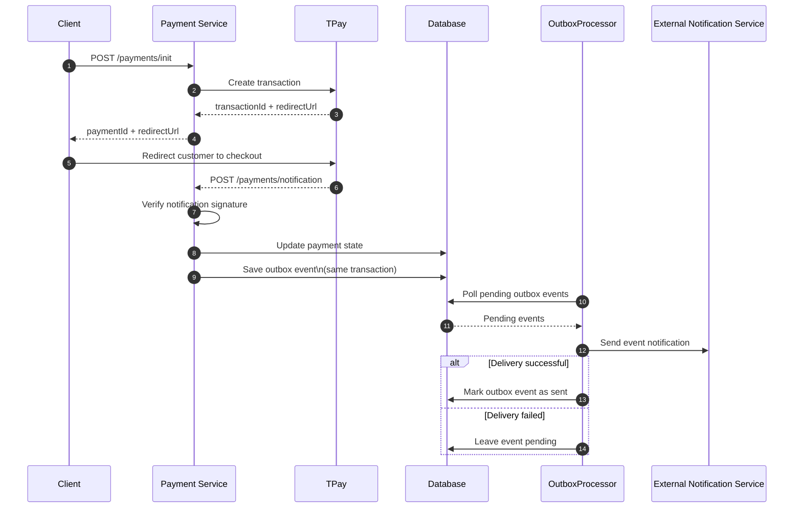
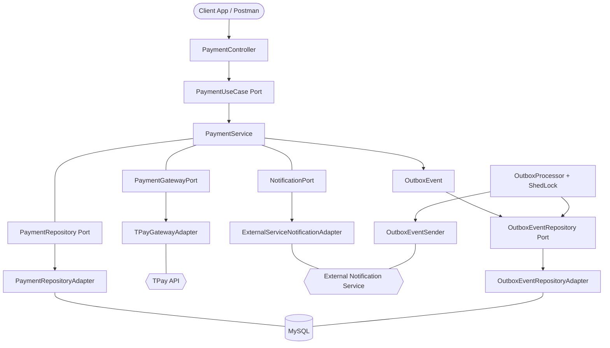

# 🚀 Payment Service - Hexagonal Payment Processing Platform

[](https://spring.io/projects/spring-boot)
 [](https://openjdk.org/)
 [](https://resilience4j.readme.io/)
 [](https://www.docker.com/)
[](https://codecov.io/gh/CoderNoOne/payment-service)
[](https://opensource.org/licenses/MIT)

## 📖 Overview

Payment Service is a production-ready backend for secure online payment initiation, TPay webhook handling, and reliable outbound notifications to an external service.

The project showcases modern backend engineering practices: Hexagonal Architecture (Ports & Adapters), the Transactional Outbox Pattern, containerized deployment, and resilient integration with external services.

## 🔄 How It Works

This is the end-to-end payment flow:

1. **Client → Payment Service:** Client sends a POST request to `/payments/init` to initialize a payment with order details (orderId, amount, email, name).
2. **Payment Service → TPay:** Payment Service calls TPay API to create a new transaction.
3. **TPay → Payment Service:** TPay responds with a transaction ID and redirect URL for customer checkout.
4. **Payment Service → Client:** Payment Service returns the payment ID and redirect URL to the client.
5. **Client → TPay:** Client redirects the customer to the TPay-hosted checkout page using the provided redirect URL.
6. **TPay → Payment Service:** After payment completion, TPay sends a POST webhook to `/payments/notification` with payment status details.
7. **Payment Service (internal):** Payment Service verifies the notification signature using the security code to ensure authenticity.
8. **Payment Service → Database:** Payment Service updates the payment state in the database based on the notification data.
9. **Payment Service → Database:** Payment Service saves an outbox event in the same database transaction to ensure consistency.
10. **OutboxProcessor → Database:** OutboxProcessor polls the database for pending outbox events that need to be sent.
11. **Database → OutboxProcessor:** Database returns the list of pending outbox events to the OutboxProcessor.
12. **OutboxProcessor → External Notification Service:** OutboxProcessor sends the event notification to the external notification service.
13. **(Alternative: Delivery successful) OutboxProcessor → Database:** If delivery succeeds, OutboxProcessor marks the outbox event as sent in the database.
14. **(Alternative: Delivery failed) OutboxProcessor → Database:** If delivery fails, OutboxProcessor leaves the outbox event pending for retry in the next polling cycle.




This approach keeps the payment state consistent even when external systems are temporarily unavailable.


## 🌐 API Endpoints

Base URL: `http://localhost:8081`

| Method | Path | Purpose | Request | Success | Common errors |
|---|---|---|---|---|---|
| `GET` | `/` | Basic service health check | none | `200 OK` (`{"message":"PAYMENT SERVICE OK"}`) | - |
| `POST` | `/payments/init` | Initialize payment and get redirect URL | JSON: `orderId`, `amount`, `email`, `name` | `200 OK` (`paymentId`, `redirectUrl`) | `400` validation, `409` payment exists, `500` integration/internal |
| `POST` | `/payments/notification` | Handle TPay webhook | `application/x-www-form-urlencoded` with `id`, `tr_id`, `tr_date`, `tr_crc`, `tr_amount`, `tr_paid`, `tr_status`, `tr_email`, `tr_error`, `tr_desc`, `md5sum` | `200 OK` (`{"result":"TRUE"}`) | `400` false/bad payload, `500` retry scenario |
| `GET` | `/payments/success` | Success callback endpoint | none | `200 OK` (`{"message":"PAYMENT OK"}`) | - |
| `GET` | `/payments/error` | Error callback endpoint | none | `200 OK` (`{"message":"PAYMENT ERROR"}`) | - |

### cURL examples

Initialize payment:

```bash
curl -X POST "http://localhost:8081/payments/init" \
  -H "Content-Type: application/json" \
  -d '{
    "orderId": "0555b450-db31-472e-9bcb-9524f8d964bd",
    "amount": 129.99,
    "email": "customer@example.com",
    "name": "John Doe"
  }'
```

TPay notification callback:

```bash
curl -X POST "http://localhost:8081/payments/notification" \
  -H "Content-Type: application/x-www-form-urlencoded" \
  --data-urlencode "id=1010" \
  --data-urlencode "tr_id=TR-123" \
  --data-urlencode "tr_date=2026-04-08 12:30:00" \
  --data-urlencode "tr_crc=0555b450-db31-472e-9bcb-9524f8d964bd" \
  --data-urlencode "tr_amount=129.99" \
  --data-urlencode "tr_paid=129.99" \
  --data-urlencode "tr_status=TRUE" \
  --data-urlencode "tr_email=customer@example.com" \
  --data-urlencode "tr_error=none" \
  --data-urlencode "tr_desc=Order 0555b450-db31-472e-9bcb-9524f8d964bd" \
  --data-urlencode "md5sum=replace_with_valid_signature"
```

Health check:

```bash
curl "http://localhost:8081/"
```

## 🚀 Getting Started

### Prerequisites

- Docker & Docker Compose v2+
- Java 25+ if building locally
- Maven 3.9+ if building locally

### 1. Environment configuration

Create a `.env` file in the project root:

```bash
# MySQL
PAYMENT_SERVICE_MYSQL_DB_ROOT_PASSWORD=your_root_password
PAYMENT_SERVICE_MYSQL_DB_NAME=payment_db
PAYMENT_SERVICE_MYSQL_DB_USER=payment_user
PAYMENT_SERVICE_MYSQL_DB_PASSWORD=your_password
PAYMENT_SERVICE_MYSQL_DB_PORT=3306
PAYMENT_SERVICE_MYSQL_DB_HOST=payment-mysql
PAYMENT_SERVICE_MYSQL_INNODB_BUFFER_POOL_SIZE=256M
PAYMENT_SERVICE_MYSQL_MAX_CONNECTIONS=100

# Application
PAYMENT_SERVICE_PORT=8081
PAYMENT_SERVICE_APPLICATION_NAME=payment-service

# TPay (sandbox)
PAYMENT_SERVICE_TPAY_API_URL=https://openapi.sandbox.tpay.com
PAYMENT_SERVICE_TPAY_API_CLIENT_ID=your_client_id
PAYMENT_SERVICE_TPAY_API_CLIENT_SECRET=your_client_secret
PAYMENT_SERVICE_TPAY_API_SECURITY_CODE=your_security_code
PAYMENT_SERVICE_TPAY_APP_NOTIFICATION_URL=https://yourdomain.com/payments/notification
PAYMENT_SERVICE_TPAY_APP_RETURN_SUCCESS_URL=https://yourdomain.com/payments/success
PAYMENT_SERVICE_TPAY_APP_RETURN_ERROR_URL=https://yourdomain.com/payments/error

# Swagger UI
SWAGGER_UI_PORT=your_preferred_port
```

> **Public callback URL:** TPay webhook notifications must reach your app from the internet, so local development requires a public HTTPS address.
>
> You can expose your local port with ngrok:
>
> ```bash
> ngrok http 8081
> ```
>
> Then replace `https://yourdomain.com` in `.env` with your public ngrok URL.

### 2. Start infrastructure

```bash
docker-compose up -d
```

By default, `docker-compose.yml` uses a pre-built image for faster startup. If you want to build locally, enable the `build` section and run:

```bash
docker-compose up -d --build
```

### 3. Verify startup

- Application: `http://localhost:8081`
- Health: `http://localhost:8081/actuator/health`
- Swagger UI: `http://localhost:8081/swagger-ui.html`
- OpenAPI JSON: `http://localhost:8081/v3/api-docs`

## 🗄️ Database Migrations

Liquibase runs automatically on startup.

- Entry point changelog: `src/main/resources/db/changelog/db.changelog-master.xml`
- Spring config: `spring.liquibase.change-log=classpath:/db/changelog/db.changelog-master.xml`
- Modular changelogs:
   - `001-create-payments-table.xml`
   - `002-create-outbox-events-table.xml`
   - `003-create-shedlock-table.xml`

## ⚙️ Environment Variables

### MySQL

| Variable | Required | Description | Example |
|---|---|---|---|
| `PAYMENT_SERVICE_MYSQL_DB_HOST` | yes | MySQL host used by the app container | `payment-mysql` |
| `PAYMENT_SERVICE_MYSQL_DB_PORT` | yes | Host port exposed for MySQL access | `3308` |
| `PAYMENT_SERVICE_MYSQL_DB_NAME` | yes | Database/schema name | `payments_db` |
| `PAYMENT_SERVICE_MYSQL_DB_USER` | yes | Application DB user | `user` |
| `PAYMENT_SERVICE_MYSQL_DB_PASSWORD` | yes | Password for DB user | `user1234` |
| `PAYMENT_SERVICE_MYSQL_DB_ROOT_PASSWORD` | yes | Root password for MySQL init | `root` |
| `PAYMENT_SERVICE_MYSQL_INNODB_BUFFER_POOL_SIZE` | optional | InnoDB buffer size | `256M` |
| `PAYMENT_SERVICE_MYSQL_MAX_CONNECTIONS` | optional | Max concurrent connections | `200` |

### Application

| Variable | Required | Description | Example |
|---|---|---|---|
| `PAYMENT_SERVICE_PORT` | yes | HTTP port exposed by the service | `8081` |
| `PAYMENT_SERVICE_APPLICATION_NAME` | optional | Spring app name | `payment-service` |
| `PAYMENT_SERVICE_OPENAPI_BASE_URL` | optional | Base URL for Swagger template | `http://localhost:8081` |
| `SWAGGER_UI_PORT` | optional | Port for Swagger UI container | `9000` |

### TPay

| Variable | Required | Description | Example |
|---|---|---|---|
| `PAYMENT_SERVICE_TPAY_API_URL` | yes | TPay API base URL | `https://openapi.sandbox.tpay.com` |
| `PAYMENT_SERVICE_TPAY_API_CLIENT_ID` | yes | OAuth client ID | `...` |
| `PAYMENT_SERVICE_TPAY_API_CLIENT_SECRET` | yes | OAuth client secret | `...` |
| `PAYMENT_SERVICE_TPAY_API_SECURITY_CODE` | yes | Merchant security code for webhook verification | `...` |
| `PAYMENT_SERVICE_TPAY_APP_NOTIFICATION_URL` | yes | Public webhook endpoint | `https://<domain>/payments/notification` |
| `PAYMENT_SERVICE_TPAY_APP_RETURN_SUCCESS_URL` | yes | Redirect after success | `https://<domain>/payments/success` |
| `PAYMENT_SERVICE_TPAY_APP_RETURN_ERROR_URL` | yes | Redirect after error/cancel | `https://<domain>/payments/error` |

### Important note

`PAYMENT_SERVICE_TPAY_API_SECURITY_CODE` is used to validate the `md5sum` signature in incoming TPay webhook notifications.  
If this value is incorrect, webhook verification fails and the notification is rejected.

## 🛠️ Common Issues

### 1) Docker does not start

Symptoms: containers exit immediately, or `docker-compose up` fails.  
Common causes: port conflict, stale containers, invalid `.env` values, or missing image.

Useful commands:

```bash
docker compose ps
docker compose config
docker compose down --volumes
docker compose up -d
```

If ports are busy, change host ports in `.env`, for example `PAYMENT_SERVICE_PORT=8082` or `PAYMENT_SERVICE_MYSQL_DB_PORT=3307`.

### 2) Database is not ready

Symptoms: connection errors on startup such as `Communications link failure` or `Connection refused`.  
Most often the app starts before MySQL is fully healthy.

Check logs:

```bash
docker compose logs payment-mysql --tail 200
docker compose logs payment-service --tail 200
```

### 3) TPay returns 401

This usually means invalid credentials or a mismatch between sandbox and production URL.  
Verify `client_id`, `client_secret`, and `security_code`, and restart the service after any `.env` change.

## 🏗️ Architecture

The system follows Hexagonal Architecture and the Transactional Outbox Pattern.



### Technical highlights

- **Hexagonal Architecture:** strict separation of domain, application, and infrastructure layers.
- **Transactional Outbox:** payment state and integration event are saved in one transaction.
- **ShedLock:** prevents multiple instances from processing the same outbox events.
- **Virtual Threads:** enabled through Spring Boot 4.0.5 and Java 25 for better I/O concurrency.
- **Resilience4j:** retry and circuit breaker protect outbound TPay calls.
- **Webhook verification:** incoming TPay notifications are validated with cryptographic signature checks.
- **Optimized Docker build:** multi-stage build, layered JAR, container-friendly JVM tuning.

## 💻 Tech Stack

| Layer | Technology |
|---|---|
| Language | Java 25 |
| Framework | Spring Boot 4.0.5, Spring Data JPA, Spring WebMVC, Spring Validation |
| Database | MySQL 9.6.0 |
| Payment Gateway | TPay API |
| Scheduling | ShedLock 6.0.2 |
| Resilience | Resilience4j 2.4.0 |
| Build Tool | Maven 3.9, JaCoCo 0.8.14 |
| Containerization | Docker, Docker Compose v2+ |
| CI | GitHub Actions, Codecov |
| Observability | Spring Boot Actuator |
| Other | Lombok, Commons Codec, Spring RestClient, SpringDoc OpenAPI |

## 🧪 Testing Strategy

The project uses a clear testing pyramid with unit and integration tests separated by Maven plugins.

- **Unit tests:** `*Test.java` run with Surefire during `mvn test`.
- **Integration tests:** `*IT.java` run with Failsafe during `mvn verify`.
- **Coverage gate:** JaCoCo enforces a minimum of **80% instruction coverage**.
- **Reports:** HTML report is generated at `target/site/jacoco/index.html`.

Run tests:

```bash
mvn test
mvn verify
```

## 🛡️ Continous Integration

GitHub Actions runs the build and tests on push and pull request to `master`.  
The pipeline generates JaCoCo reports, uploads artifacts, and sends coverage data to Codecov.

## 📊 Observability

The service exposes health endpoints through Spring Boot Actuator.  
`/actuator/health` is used for Docker health checks and orchestration probes.

## 📂 Repository Structure

```text
.
├── .github/
│   └── workflows/
│       └── ci.yml
├── src/
│   ├── main/
│   │   ├── java/
│   │   │   └── com/rzodeczko/paymentservice/
│   │   │       ├── application/
│   │   │       ├── domain/
│   │   │       ├── infrastructure/
│   │   │       └── presentation/
│   │   └── resources/
│   │       ├── application.yaml
│   │       └── db/
│   │           └── changelog/
│   └── test/
│       ├── java/
│       └── resources/
├── .env.example
├── docker-compose.yml
├── Dockerfile
├── pom.xml
└── README.md
```

## 🔮 Future Roadmap

Planned improvements include:

- Testcontainers for isolated integration tests.
- Kafka or RabbitMQ instead of polling for outbox delivery.

## 🤝 Contact

Designed and implemented by **Michał Rzodeczko**.  
GitHub: [mrzodeczko-dev](https://github.com/mrzodeczko-dev)
