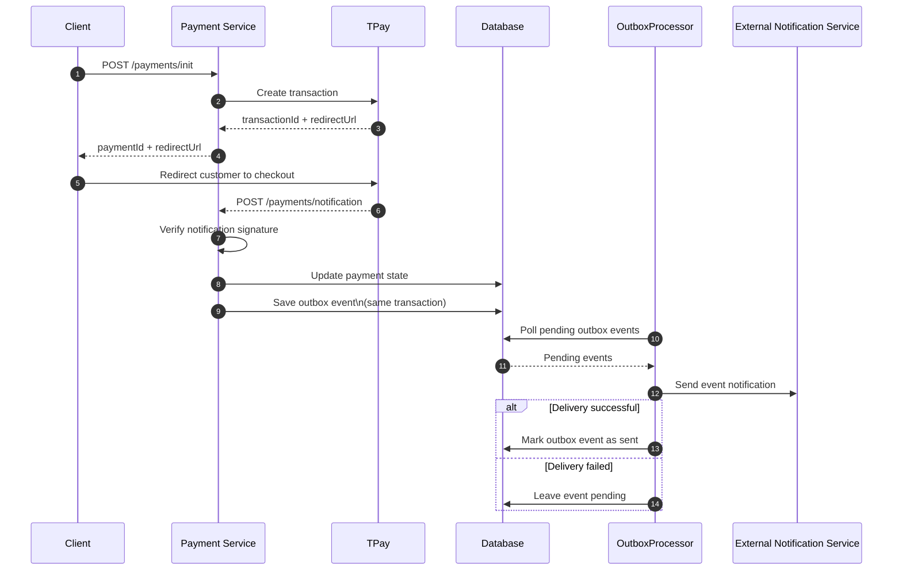
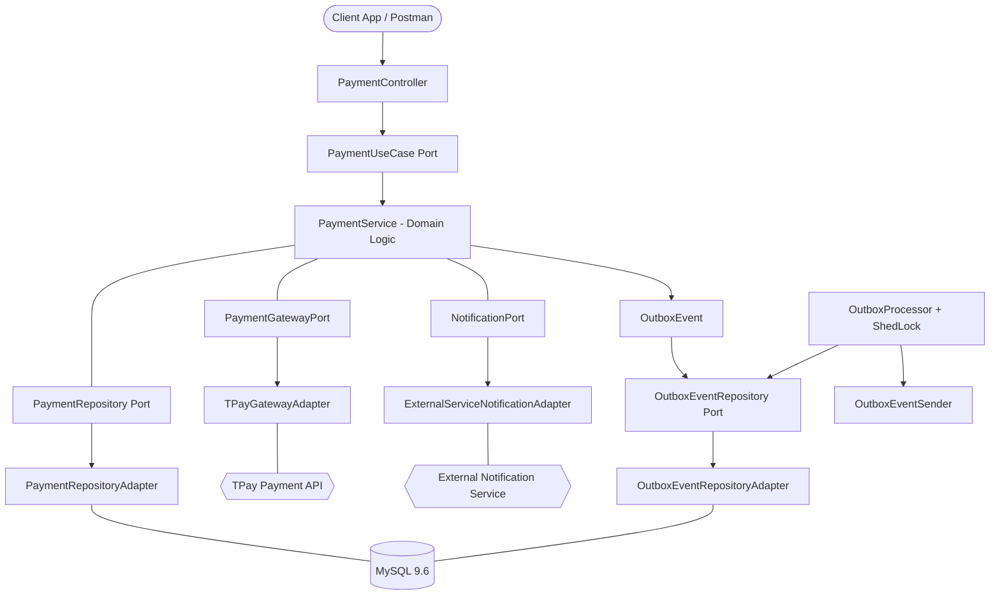

# 🚀 Payment Service - Hexagonal Payment Processing Platform

[](https://spring.io/projects/spring-boot)
[](https://openjdk.org/)
[](https://www.docker.com/)
[](https://codecov.io/gh/CoderNoOne/payment-service)
[](https://opensource.org/licenses/MIT)

<a id="toc"></a>
## 📚 Table of Contents

- [📖 Overview](#overview)
- [🔄 How It Works (End-to-End Payment Flow)](#how-it-works)
- [🌐 API Endpoints (Quick Reference)](#api-endpoints)
- [🚀 Getting Started (Local Environment)](#getting-started)
- [⚙️ Environment Variables](#environment-variables)
- [🛠️ Common Issues / Troubleshooting](#common-issues)
- [🏗️ Architecture](#architecture)
- [✨ Technical Highlights & Engineering Decisions](#technical-highlights)
- [💻 Tech Stack](#tech-stack)
- [🧪 Testing Strategy & Quality Assurance](#testing-strategy)
- [🛡️ CI/CD Pipeline](#cicd-pipeline)
- [📊 Observability](#observability)
- [📂 Repository Structure](#repository-structure)
- [🔮 Future Roadmap (Architectural Evolution)](#future-roadmap)
- [🤝 Contact](#contact)

<a id="overview"></a>
## 📖 Overview

[Back to Table of Contents](#toc)

Payment Service is a production-ready, modular payment processing backend built to handle secure online payment initiation, webhook notification handling, and reliable event publishing via the TPay payment gateway.

This repository serves as a showcase of modern backend engineering practices (as of 2026), demonstrating clean Hexagonal Architecture (Ports & Adapters), the Transactional Outbox Pattern, and a containerized development environment ready for seamless deployment.

<a id="how-it-works"></a>
## 🔄 How It Works (End-to-End Payment Flow)

[Back to Table of Contents](#toc)

This is the complete payment lifecycle from API request to downstream notification delivery:


### Interaction sequence



1. **Payment initiation (`POST /payments/init`)**  
   The client sends payment data (amount, order ID, customer details) to the Payment Service. The application validates input and invokes the payment use case.

2. **Create payment in TPay + redirect URL**  
   The service calls TPay API to create a transaction and receives gateway data (including redirect URL and external transaction ID). The redirect URL is returned to the client.

3. **Customer redirect to TPay checkout**  
   The frontend redirects the customer to TPay-hosted payment page, where the user completes or cancels the payment.

4. **TPay webhook callback (`/payments/notification`)**  
   After payment status changes, TPay sends a server-to-server webhook to the configured notification endpoint. The service verifies the notification signature and parses payment status.

5. **Transactional state update + outbox write**  
   In one local database transaction, the service updates payment state and saves a matching outbox event. This guarantees that business state and integration event stay consistent.

6. **Outbox processor picks pending events**  
   `OutboxProcessor` periodically scans unsent outbox records (with ShedLock protection to avoid duplicate processing in multi-instance deployments).

7. **External notification delivery**  
   `OutboxEventSender` publishes the event to the external notification service. On success, the outbox record is marked as sent; on failure, it remains pending and is retried on the next cycle.

8. **Eventual consistency and reliability**  
   Even if external systems are temporarily unavailable, payment status remains persisted, and notification delivery is retried asynchronously until successful.

<a id="api-endpoints"></a>
## 🌐 API Endpoints (Quick Reference)

[Back to Table of Contents](#toc)

Base URL (local): `http://localhost:8081`

| Method | Path | Purpose | Request | Success | Common errors |
|---|---|---|---|---|---|
| `GET` | `/` | Basic service health check | none | `200 OK` (`{"message":"PAYMENT SERVICE OK"}`) | - |
| `POST` | `/payments/init` | Initialize payment and get redirect URL | JSON: `orderId`, `amount`, `email`, `name` | `200 OK` (`paymentId`, `redirectUrl`) | `400` (validation), `409` (payment exists), `500` (integration/internal) |
| `POST` | `/payments/notification` | Handle TPay webhook (form data) | `application/x-www-form-urlencoded` with `id`, `tr_id`, `tr_date`, `tr_crc`, `tr_amount`, `tr_paid`, `tr_status`, `tr_email`, `tr_error`, `tr_desc`, `md5sum` | `200 OK` (`{"result":"TRUE"}`) | `400` (`FALSE`, bad payload/signature), `500` (`FALSE`, retry scenario) |
| `GET` | `/payments/success` | Success callback endpoint | none | `200 OK` (`{"message":"PAYMENT OK"}`) | - |

`GET /payments/error` is also available and returns `200 OK` with `{"message":"PAYMENT ERROR"}`.

### cURL examples

Initialize payment:

```bash
curl -X POST "http://localhost:8081/payments/init" \
  -H "Content-Type: application/json" \
  -d '{
    "orderId": "11111111-1111-1111-1111-111111111111",
    "amount": 129.99,
    "email": "customer@example.com",
    "name": "John Doe"
  }'
```

TPay notification callback (example payload):

```bash
curl -X POST "http://localhost:8081/payments/notification" \
  -H "Content-Type: application/x-www-form-urlencoded" \
  --data-urlencode "id=1010" \
  --data-urlencode "tr_id=TR-123" \
  --data-urlencode "tr_date=2026-04-08 12:30:00" \
  --data-urlencode "tr_crc=11111111-1111-1111-1111-111111111111" \
  --data-urlencode "tr_amount=129.99" \
  --data-urlencode "tr_paid=129.99" \
  --data-urlencode "tr_status=TRUE" \
  --data-urlencode "tr_email=customer@example.com" \
  --data-urlencode "tr_error=none" \
  --data-urlencode "tr_desc=Order 11111111-1111-1111-1111-111111111111" \
  --data-urlencode "md5sum=replace_with_valid_signature"
```

Health check:

```bash
curl "http://localhost:8081/"
```

<a id="getting-started"></a>
## 🚀 Getting Started (Local Environment)

[Back to Table of Contents](#toc)

### Prerequisites
* Docker & Docker Compose v2+
* Java 25+ (if running outside containers)
* Maven 3.9+ (if running outside containers)

### 1. Environment Configuration
Create a `.env` file in the project root with the following variables:

```bash
# MySQL
PAYMENT_SERVICE_MYSQL_DB_ROOT_PASSWORD=your_root_password
PAYMENT_SERVICE_MYSQL_DB_NAME=payment_db
PAYMENT_SERVICE_MYSQL_DB_USER=payment_user
PAYMENT_SERVICE_MYSQL_DB_PASSWORD=your_password
PAYMENT_SERVICE_MYSQL_DB_PORT=3306
PAYMENT_SERVICE_MYSQL_DB_HOST=payment-mysql
PAYMENT_SERVICE_MYSQL_INNODB_BUFFER_POOL_SIZE=256M
PAYMENT_SERVICE_MYSQL_MAX_CONNECTIONS=100

# Application
PAYMENT_SERVICE_PORT=8081
PAYMENT_SERVICE_APPLICATION_NAME=payment-service

# TPay (sandbox: https://panel.sandbox.tpay.com/)
PAYMENT_SERVICE_TPAY_API_URL=https://openapi.sandbox.tpay.com
PAYMENT_SERVICE_TPAY_API_CLIENT_ID=your_client_id
PAYMENT_SERVICE_TPAY_API_CLIENT_SECRET=your_client_secret
PAYMENT_SERVICE_TPAY_API_SECURITY_CODE=your_security_code
PAYMENT_SERVICE_TPAY_APP_NOTIFICATION_URL=https://yourdomain.com/api/payments/notifications
PAYMENT_SERVICE_TPAY_APP_RETURN_SUCCESS_URL=https://yourdomain.com/payment/success
PAYMENT_SERVICE_TPAY_APP_RETURN_ERROR_URL=https://yourdomain.com/payment/error
```

> **🌍 Public URL for TPay callbacks:** TPay webhook notifications must reach your app from the internet, so your local service needs a public HTTPS address.
>
> You can expose local port `8081` with ngrok:
>
> ```bash
> ngrok http 8081
> ```
>
> Then replace `https://yourdomain.com` in `.env` with your ngrok URL (for example `https://abcd-1234.ngrok-free.app`) in:
> - `PAYMENT_SERVICE_TPAY_APP_NOTIFICATION_URL`
> - `PAYMENT_SERVICE_TPAY_APP_RETURN_SUCCESS_URL`
> - `PAYMENT_SERVICE_TPAY_APP_RETURN_ERROR_URL`

> **💡 TPay Sandbox:** You can register and configure your TPay test credentials at [panel.sandbox.tpay.com](https://panel.sandbox.tpay.com/). The sandbox environment allows full payment flow testing without real transactions.

### 2. Bootstrapping the Infrastructure
Spin up the database and service with a single command:

```bash
docker-compose up -d --build
```

### 3. Verification
* Payment Service API: `http://localhost:8081`
* Health Check: `http://localhost:8081/actuator/health`
* MySQL: `localhost:3306` (via configured port)

### 4. Running Tests Locally

```bash
mvn verify
```

Coverage report will be generated at `target/site/jacoco/index.html`.

<a id="environment-variables"></a>
## ⚙️ Environment Variables

[Back to Table of Contents](#toc)

The project reads values from `.env` (used by Docker Compose). Below is a practical reference for each variable.

> Note: in `docker-compose.yml`, `PAYMENT_SERVICE_TPAY_*` variables are mapped to container-level `TPAY_*` variables consumed by `application.yaml`.

### MySQL

| Variable | Required | Description | Allowed / expected values | Example |
|---|---|---|---|---|
| `PAYMENT_SERVICE_MYSQL_DB_HOST` | yes | Hostname of MySQL service used by the app container. | Docker service name or host/IP. | `payment-mysql` |
| `PAYMENT_SERVICE_MYSQL_DB_PORT` | yes | Host port exposed for MySQL access from your machine. | Free TCP port (usually `3306` or custom). | `3308` |
| `PAYMENT_SERVICE_MYSQL_DB_NAME` | yes | Database/schema name created at startup. | Valid MySQL schema name. | `payments_db` |
| `PAYMENT_SERVICE_MYSQL_DB_USER` | yes | Application DB user. | Non-root username. | `user` |
| `PAYMENT_SERVICE_MYSQL_DB_PASSWORD` | yes | Password for DB user. | Strong secret string. | `user1234` |
| `PAYMENT_SERVICE_MYSQL_DB_ROOT_PASSWORD` | yes | Root password for MySQL container initialization. | Strong secret string. | `root` |
| `PAYMENT_SERVICE_MYSQL_INNODB_BUFFER_POOL_SIZE` | optional (recommended) | InnoDB memory buffer size. | MySQL memory format (`128M`, `256M`, ...). | `256M` |
| `PAYMENT_SERVICE_MYSQL_MAX_CONNECTIONS` | optional (recommended) | Max MySQL concurrent connections. | Positive integer. | `200` |

### Application

| Variable | Required | Description | Allowed / expected values | Example |
|---|---|---|---|---|
| `PAYMENT_SERVICE_PORT` | yes | HTTP port exposed by the payment service container. | Free TCP port. | `8081` |
| `PAYMENT_SERVICE_APPLICATION_NAME` | optional | Spring application name (logging/metadata). | Any non-empty string. | `payment-service` |

### TPay

| Variable | Required | Description | Allowed / expected values | Example |
|---|---|---|---|---|
| `PAYMENT_SERVICE_TPAY_API_URL` | yes | Base URL for TPay API. | Sandbox: `https://openapi.sandbox.tpay.com`, Prod: TPay production OpenAPI URL. | `https://openapi.sandbox.tpay.com` |
| `PAYMENT_SERVICE_TPAY_API_CLIENT_ID` | yes | OAuth client identifier used to authenticate against TPay API. | Value generated in TPay panel for your merchant app. | `...` |
| `PAYMENT_SERVICE_TPAY_API_CLIENT_SECRET` | yes | OAuth client secret for TPay API token exchange. | Secret generated in TPay panel. | `...` |
| `PAYMENT_SERVICE_TPAY_API_SECURITY_CODE` | yes | Merchant security code used to verify webhook signature (`md5sum`). | Secret value from TPay panel, exact match required. | `...` |
| `PAYMENT_SERVICE_TPAY_APP_NOTIFICATION_URL` | yes | Public webhook endpoint called by TPay after payment status changes. | Public HTTPS URL reachable from internet. | `https://<domain>/payments/notification` |
| `PAYMENT_SERVICE_TPAY_APP_RETURN_SUCCESS_URL` | yes | URL where customer is redirected after successful payment flow. | Public HTTPS URL. | `https://<domain>/payments/success` |
| `PAYMENT_SERVICE_TPAY_APP_RETURN_ERROR_URL` | yes | URL where customer is redirected after failed/cancelled payment flow. | Public HTTPS URL. | `https://<domain>/payments/error` |

### What is `PAYMENT_SERVICE_TPAY_API_SECURITY_CODE`?

- It is the **merchant security code** used to validate TPay notification signature (`md5sum`) server-side.
- If this value is wrong, webhook verification fails and notifications are rejected (for example `FALSE` / invalid signature errors).
- Where to find it in TPay panel: merchant settings related to notifications/security (in sandbox panel, under notification security configuration).

### Required vs optional (quick summary)

- **Required in practice:** all `PAYMENT_SERVICE_TPAY_*`, DB credentials/host/name/port, and `PAYMENT_SERVICE_PORT`.
- **Optional/tunable:** `PAYMENT_SERVICE_APPLICATION_NAME`, `PAYMENT_SERVICE_MYSQL_INNODB_BUFFER_POOL_SIZE`, `PAYMENT_SERVICE_MYSQL_MAX_CONNECTIONS`.

<a id="common-issues"></a>
## 🛠️ Common Issues / Troubleshooting

[Back to Table of Contents](#toc)

### 1) Docker does not start

- **Symptoms:** `docker-compose up` fails, containers exit immediately, or build hangs.
- **Most common causes:** Port conflict, stale containers/images, invalid `.env` values.
- **What to do:**

```bash
docker compose ps
docker compose config
docker compose down
docker compose up -d --build
```

If ports are already in use, change host ports in `.env`/`docker-compose.yml` (for example app or MySQL port mappings).

### 2) Database is not ready

- **Symptoms:** App logs show DB connection errors at startup (`Communications link failure`, `Connection refused`).
- **Most common cause:** MySQL container is still booting while app tries to connect.
- **What to do:**

```bash
docker compose ps
docker compose logs payment-mysql --tail 200
docker compose logs payment-service --tail 200
```

Verify `PAYMENT_SERVICE_MYSQL_*` values in `.env` (host, port, db name, user, password) and wait until MySQL is healthy before retrying app startup.

### 3) TPay returns 401 (Unauthorized)

- **Symptoms:** Payment creation/authentication call fails with HTTP `401`.
- **Most common causes:** Wrong `client_id`/`client_secret`, mismatched sandbox vs production URL, revoked/rotated credentials.
- **What to do:**

1. Validate `PAYMENT_SERVICE_TPAY_API_CLIENT_ID` and `PAYMENT_SERVICE_TPAY_API_CLIENT_SECRET`.
2. Ensure URL/environment match (`sandbox` credentials with sandbox API URL).
3. Confirm credentials in TPay panel and rotate secret if needed.
4. Restart service after `.env` changes.

```bash
docker compose up -d --build
docker compose logs payment-service --tail 200
```

<a id="architecture"></a>
## 🏗️ Architecture

[Back to Table of Contents](#toc)

The system follows a **Hexagonal Architecture (Ports & Adapters)** approach, strictly separating domain logic from infrastructure concerns. The Transactional Outbox Pattern guarantees reliable event delivery without distributed transactions.



<a id="technical-highlights"></a>
## ✨ Technical Highlights & Engineering Decisions

[Back to Table of Contents](#toc)

* **Hexagonal Architecture (Ports & Adapters):** Strict boundary between domain, application, and infrastructure layers. Business logic is fully decoupled from frameworks, databases, and external APIs — enabling independent testability and easy adapter swapping.
* **Transactional Outbox Pattern:** Payment state changes and outbox events are persisted in a single database transaction, guaranteeing eventual consistency and eliminating the dual-write problem. The `OutboxProcessor` polls and dispatches pending events reliably.
* **Distributed Lock with ShedLock:** The `OutboxProcessor` uses ShedLock (JDBC-backed) to ensure that only one instance processes outbox events at a time — critical for horizontal scaling without duplicate event delivery.
* **Virtual Threads (Project Loom):** Spring Boot is configured with `spring.threads.virtual.enabled=true`, leveraging Java 25 virtual threads to maximize throughput on I/O-bound payment gateway calls without the overhead of platform thread pools.
* **Secure Notification Verification:** Incoming TPay webhook notifications are validated using cryptographic signature verification (`commons-codec`), protecting against spoofed payment callbacks.
* **Optimized Docker Build:** Multi-stage Dockerfile with Maven dependency caching and Spring Boot layered JAR extraction, resulting in fast rebuilds and minimal runtime image size.

<a id="tech-stack"></a>
## 💻 Tech Stack

[Back to Table of Contents](#toc)

| Layer              | Technology                                                   |
|--------------------|--------------------------------------------------------------|
| **Language**       | Java 25                                                      |
| **Framework**      | Spring Boot 4.0.5, Spring Data JPA, Spring WebMVC, Spring Validation |
| **Database**       | MySQL 9.6.0 (HikariCP connection pool)                      |
| **Payment Gateway**| TPay API (OAuth2 + REST)                                     |
| **Scheduling**     | ShedLock 6.0.2 (JDBC provider)                              |
| **Build Tool**     | Maven 3.9, JaCoCo 0.8.14                                    |
| **Containerization**| Docker (multi-stage build), Docker Compose                  |
| **CI/CD**          | GitHub Actions, Codecov                                      |
| **Observability**  | Spring Boot Actuator                                         |
| **Other**          | Lombok, Commons Codec, Spring RestClient                     |

<a id="testing-strategy"></a>
## 🧪 Testing Strategy & Quality Assurance

[Back to Table of Contents](#toc)

The project employs a robust testing pyramid with clear separation between unit and integration tests:

* **Unit Tests (18 classes):** Pure domain and infrastructure logic tested in isolation — covering domain models (`Payment`, `OutboxEvent`), custom exceptions, mappers, adapters, and the `OutboxProcessor`/`OutboxEventSender` pipeline. All tests use JUnit 5 and Mockito.
* **Integration tests execution model:** The current Maven setup uses one test phase (`surefire`) and does not yet define a separate `failsafe` integration-test phase/profile. In practice, tests run together unless you filter by class pattern.
* **Code Coverage Gate:** JaCoCo enforces a strict minimum of **80% instruction coverage** at the bundle level — the build fails if coverage drops below the threshold.

### How to run tests

Run all tests (fast local check):

```bash
mvn test
```

Run all tests with JaCoCo report + coverage gate (same as CI quality gate):

```bash
mvn verify
```

Run selected unit tests only (example class filter):

```bash
mvn -Dtest="PaymentTest,OutboxEventTest,PaymentServiceTest,OutboxProcessorTest" test
```

Run selected integration-like/web-layer tests only (example class filter):

```bash
mvn -Dtest="PaymentServiceApplicationTest,GlobalExceptionHandlerTest" test
```

> Tip: until a dedicated integration-test profile is added, use `-Dtest="ClassA,ClassB,..."` to run precise subsets.

### How to interpret JaCoCo report

- HTML report: `target/site/jacoco/index.html`
- XML report (used by CI tools): `target/site/jacoco/jacoco.xml`
- Quality gate in `pom.xml`: **BUNDLE / INSTRUCTION / COVEREDRATIO >= 0.80**
- If coverage is below 80%, `mvn verify` fails in `jacoco:check`

Read the HTML report top-down: start with package and class coverage, then prioritize classes with the lowest instruction coverage in the core payment flow.


<a id="cicd-pipeline"></a>
## 🛡️ CI/CD Pipeline

[Back to Table of Contents](#toc)

The project uses **GitHub Actions** for Continuous Integration with automated quality gates:

```yaml
# Triggered on push/PR to master
- Checkout code
- Set up Java 25 (Temurin)
- Build & run tests (mvn verify)
- Upload JaCoCo coverage report (artifact, 7-day retention)
- Upload coverage to Codecov (fail_ci_if_error: true)
```

* **Build:** Maven `verify` phase runs all unit and integration tests with JaCoCo instrumentation.
* **Coverage Reporting:** JaCoCo HTML report is uploaded as a build artifact; XML report is pushed to Codecov for trend tracking and PR annotations.
* **Quality Gate:** Both JaCoCo (80% minimum) and Codecov (`fail_ci_if_error: true`) act as hard gates — a failing coverage check blocks the pipeline.

<a id="observability"></a>
## 📊 Observability

[Back to Table of Contents](#toc)

The service exposes health and readiness endpoints via **Spring Boot Actuator**:

* **Health Endpoint:** `GET /actuator/health` — used by Docker healthcheck (`wget -qO- http://localhost:8081/actuator/health`) and orchestrators for readiness probing.
* **Custom Health Check:** `GET /health` — application-level health check controller returning service status.
* **JVM Tuning:** Container-aware JVM settings (`-XX:+UseContainerSupport`, `-XX:MaxRAMPercentage=75.0`, G1GC) ensure stable memory behavior under constrained Docker resources.

<a id="repository-structure"></a>
## 📂 Repository Structure

[Back to Table of Contents](#toc)

```text
.
├── .github/
│   └── workflows/
│       └── ci.yml                        # GitHub Actions CI pipeline
├── src/
│   ├── main/
│   │   ├── java/com/rzodeczko/paymentservice/
│   │   │   ├── application/
│   │   │   │   ├── port/input/           # Inbound ports (PaymentUseCase)
│   │   │   │   ├── port/output/          # Outbound ports (PaymentGatewayPort, NotificationPort)
│   │   │   │   └── service/              # Domain services (PaymentService)
│   │   │   ├── domain/
│   │   │   │   ├── exception/            # Domain exceptions
│   │   │   │   ├── model/                # Domain models (Payment, OutboxEvent)
│   │   │   │   └── repository/           # Repository interfaces
│   │   │   ├── infrastructure/
│   │   │   │   ├── configuration/        # Spring beans & TPay properties
│   │   │   │   ├── gateway/tpay/         # TPay adapter & DTOs
│   │   │   │   ├── notification/         # External notification adapter
│   │   │   │   ├── outbox/               # Outbox processor & sender
│   │   │   │   ├── persistence/          # JPA entities, mappers, adapters
│   │   │   │   ├── transaction/          # Transaction boundary
│   │   │   │   └── usecase/              # Use case implementations
│   │   │   └── presentation/
│   │   │       ├── controller/           # REST controllers
│   │   │       ├── dto/                  # Request/Response DTOs
│   │   │       └── exception/            # Global exception handler
│   │   └── resources/
│   │       ├── application.yaml          # Application configuration
│   │       └── schema.sql                # ShedLock table schema
│   └── test/                             # Unit & integration tests
├── .env                                  # Environment variables
├── docker-compose.yml                    # Local container orchestration
├── Dockerfile                            # Multi-stage Docker build
└── pom.xml                               # Maven build configuration
```

<a id="future-roadmap"></a>
## 🔮 Future Roadmap (Architectural Evolution)

[Back to Table of Contents](#toc)

Planned iterations for system evolution include:

* **Liquibase:** Replacing `schema.sql` with versioned, rollback-capable database migrations for safe multi-environment deployments.
* **Testcontainers:** Ephemeral MySQL instances in integration tests via [Testcontainers](https://testcontainers.com/) — fully isolated, reproducible runs without external DB dependencies.
* **GCP Cloud Run + IAP:** Replacing ngrok with [Cloud Run](https://cloud.google.com/run) and Identity-Aware Proxy for secure, stable webhook exposure during development.
* **Event-Driven Outbox:** Transitioning from polling (`OutboxProcessor`) to a message broker (Kafka/RabbitMQ) for lower latency event dispatch.
* **OpenAPI/Swagger UI:** Interactive API documentation and contract-first development.
* **Kubernetes Manifests:** Production-grade K8s Deployments, Services, ConfigMaps, and Secrets.

<a id="contact"></a>
## 🤝 Contact

[Back to Table of Contents](#toc)

Designed and implemented by **Michał Rzodeczko**.
Feel free to check out my other projects on [GitHub](https://github.com/CoderNoOne).
